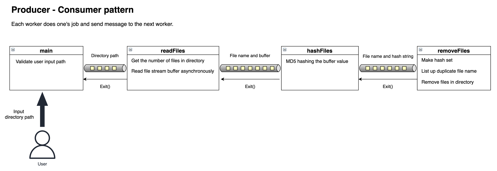

# Remove Duplicate Files

## Introduction
Remove duplicate files by inputting directory path

## Requirements

 \
  \


## Quick Start
#### (1) Transpile .ts to .js
```bash
# you can also run `yarn run build`
$ npm run build
$ cd dist
```
#### (2) Copy the path of directory where duplicate files exist
#### (3) Execute command below
```bash
$ node main.js [your-directory-path]
```

## Quick Test
```bash
$ npm run build
$ cd dist
# There exists 4 duplicates file. 
# After execution this, just one file left.
# The other ones are to be removed.
$ node main.js ./example-images
```

## Architecture
### Diagram


### Service flow video
https://user-images.githubusercontent.com/48945177/140678191-97635493-7713-4c1e-b385-c7ce0f1500bb.mov
